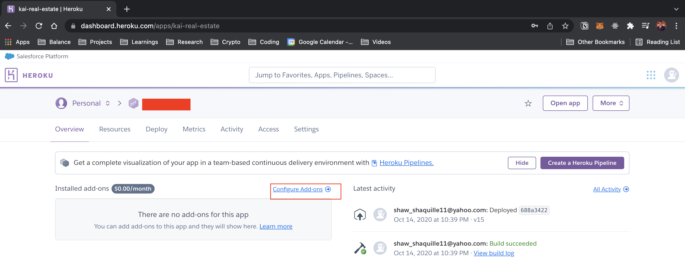
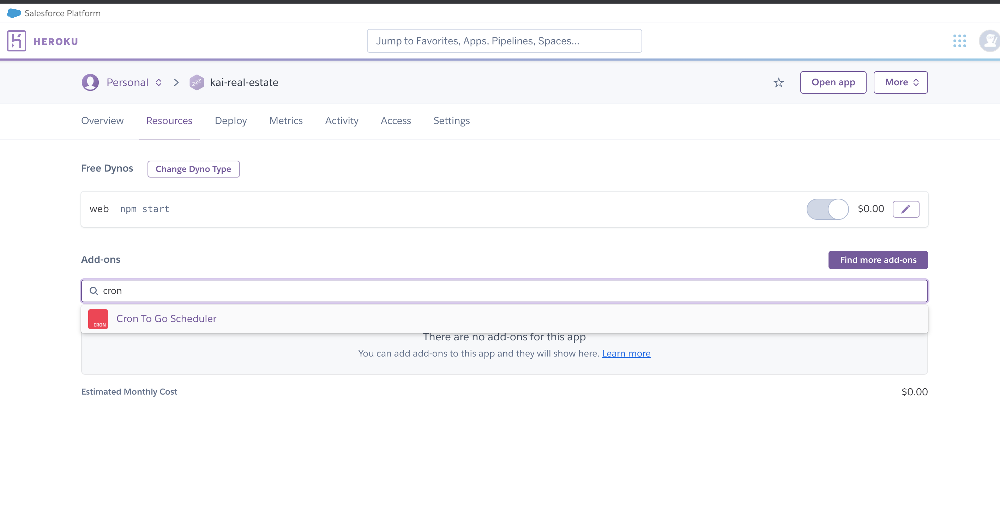
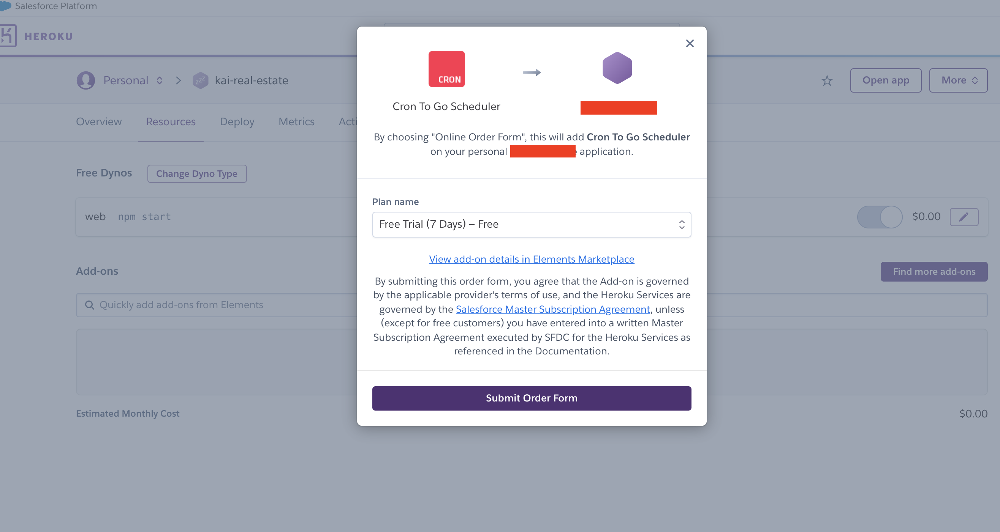
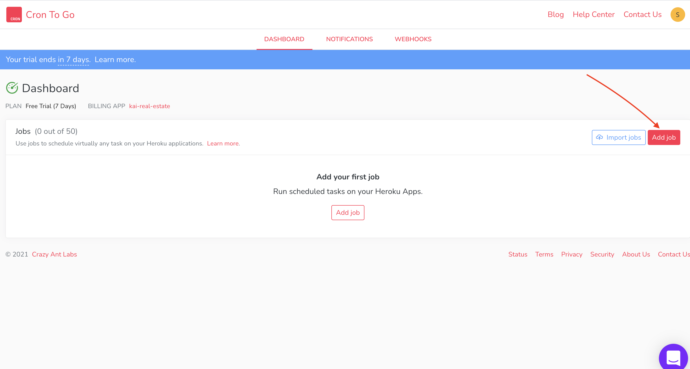
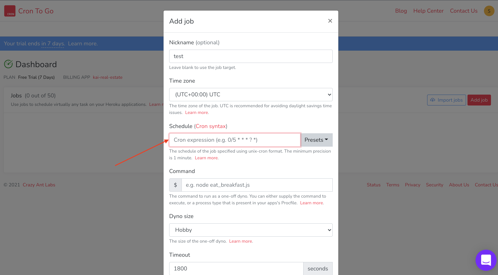

## Add Cron Jobs 

### First Time Setup

#### 1. Add a Cron Job Helper to your app in Heroku

Navigate to your heroku app, and add a Cron-to-Go Scheduler

#### 2. Choose how often you want to run the job

#### 3. Add cron job command in Heroku

Add a cron job in Cron To Go Scheduler and add a schedule based on the [cron time string format](https://support.acquia.com/hc/en-us/articles/360004224494-Cron-time-string-format)

Add your cron time, and then point to the file you would like the job to run

        node ./server/cronJobs/index.js

### Subsequent Jobs Setups

Create new file and run it on the /server/cronJobs/index.js  
